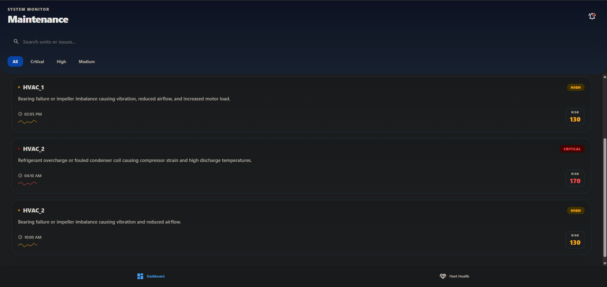
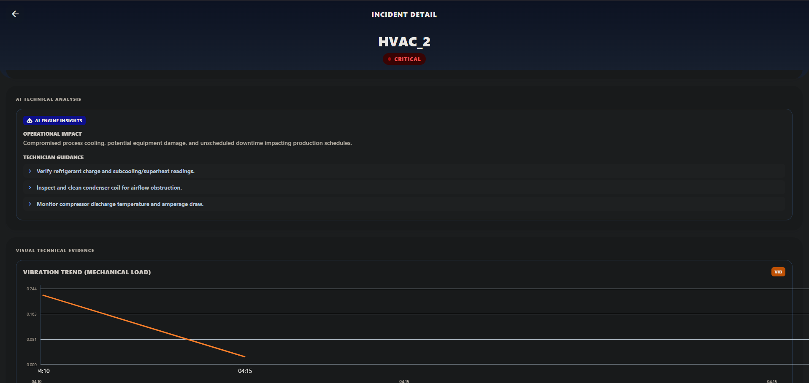
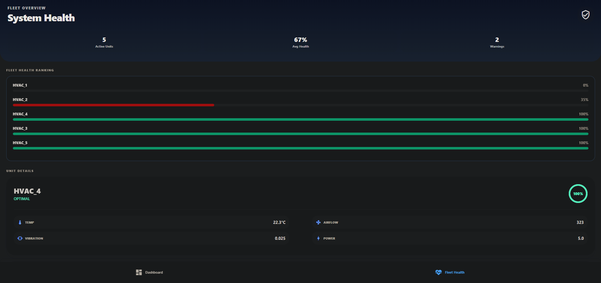

# AI-Powered HVAC Maintenance Intelligence Platform

An explainable AI maintenance copilot for HVAC systems that combines anomaly detection, engineering-informed operational reasoning, telemetry visualization, and LLM-powered technician insights.

---

# Overview

Traditional HVAC monitoring systems rely heavily on static threshold alerts. While these systems can detect extreme conditions, they often fail to explain:

* why a failure is happening
* whether degradation is sustained or transient
* how multiple telemetry signals correlate
* what operational impact the issue may cause
* what a technician should investigate first

This project was designed to move beyond simple threshold alerts and instead create an explainable operational intelligence platform.

The system combines:

* machine learning anomaly detection
* engineering-informed severity logic
* telemetry correlation analysis
* incident grouping
* fleet health scoring
* LLM-powered technician interpretation
* mobile-first operational visualization

The goal was not to build the most complex AI system possible.

The goal was to build something operationally believable, explainable, and useful to a real technician on a factory floor.

---

# Key Features

## AI Anomaly Detection

Uses Isolation Forest anomaly detection to identify abnormal HVAC telemetry behavior across:

* temperature
* airflow
* vibration
* pressure
* power consumption
* rate-of-change features

---

## Engineering-Informed Operational Reasoning

The system intentionally separates:

* anomaly detection
* operational severity
* maintenance interpretation

This prevents the AI from making unrealistic conclusions based solely on anomaly scores.

Severity classification incorporates:

* thermal danger
* sustained mechanical degradation
* airflow collapse
* correlated telemetry behavior

---

## Incident Intelligence Engine

Individual anomaly events are grouped into meaningful operational incidents.

Instead of producing dozens of noisy alerts, the system condenses telemetry anomalies into technician-readable maintenance events.

Example:

* 27 individual anomaly detections
  →
* 1 sustained HVAC degradation incident

---

## Explainable Telemetry Visualizations

The mobile dashboard visualizes:

* vibration escalation
* airflow degradation
* temperature spikes
* risk score progression

The goal was to visually prove WHY the AI detected an issue rather than forcing users to trust a black-box decision.

---

## LLM-Powered Technician Interpretation

LLMs are intentionally used only for:

* operational explanation
* technician guidance
* telemetry interpretation
* maintenance summaries

The LLM is NOT used for:

* anomaly detection
* severity scoring
* predictive maintenance forecasting

This design decision was intentional to preserve operational reliability and reduce hallucinated maintenance decisions.

---

## Fleet Health Monitoring

The application provides:

* per-unit health scoring
* severity distribution
* fleet-wide operational visibility
* incident prioritization

---

# System Architecture

```text
HVAC Sensor Telemetry
        ↓
Data Preprocessing & Cleaning
        ↓
Feature Engineering
        ↓
Isolation Forest Anomaly Detection
        ↓
Operational Severity Classification
        ↓
Incident Intelligence Engine
        ↓
Fleet Health Scoring
        ↓
LLM Operational Interpretation
        ↓
FastAPI Backend APIs
        ↓
React Native Mobile Dashboard
```

---

# AI Pipeline

# 1. Data Preprocessing

Raw telemetry data is cleaned and standardized.

The preprocessing pipeline handles:

* missing telemetry values
* interpolation
* rolling averages
* rate-of-change feature generation
* risk score generation

Generated features include:

* temp_change
* airflow_change
* vibration_change
* pressure_change
* power_change

---

# 2. Anomaly Detection

The system uses Isolation Forest because:

* the telemetry data is highly unsupervised
* anomalies are rare
* operational failures are pattern-based
* labeled failure data was unavailable

Isolation Forest identifies behavioral outliers across:

* sensor values
* telemetry transitions
* operational instability patterns

---

# 3. Operational Severity Logic

One important design decision was intentionally separating:

* anomaly detection
  from
* operational severity

An anomaly does not always mean a catastrophic operational condition.

Examples:

* transient telemetry spikes
* temporary sensor instability
* short-lived airflow disruptions

The system therefore combines ML outputs with engineering-informed operational rules.

Examples:

* critical thermal overload
* sustained vibration degradation
* airflow collapse
* correlated mechanical instability

---

# 4. Incident Grouping

Instead of exposing raw anomaly events directly to users, the platform groups temporally-related anomalies into higher-level incidents.

This dramatically reduces alert fatigue.

Example:

* 27 anomaly detections
  → grouped into
* 1 sustained mechanical degradation incident

---

# 5. LLM Operational Interpretation

The platform uses OpenRouter-based LLM APIs to transform structured telemetry events into technician-friendly operational explanations.

The LLM receives:

* incident severity
* symptoms
* telemetry summaries
* operational metrics
* maintenance context

The model then generates:

* operational summaries
* impact analysis
* technician guidance

The LLM was intentionally restricted to interpretation and communication tasks rather than core anomaly reasoning.

---

# Why I Used AI This Way

A major design goal of this project was intentional AI usage.

I initially considered using LLMs for anomaly detection and maintenance reasoning directly.

However, I decided against that approach because:

* telemetry anomalies are fundamentally statistical
* operational severity requires deterministic engineering reasoning
* unrestricted LLM decision-making could reduce technician trust
* the available dataset was insufficient for reliable predictive forecasting

Instead, I separated responsibilities across the system:

| Layer             | Responsibility                          |
| ----------------- | --------------------------------------- |
| Isolation Forest  | anomaly detection                       |
| Engineering Rules | severity & operational logic            |
| Incident Engine   | event grouping & diagnosis              |
| LLM               | explanation & technician interpretation |

This architecture provided a much more explainable and operationally believable system.

---

# Trade-Offs & Design Decisions

# Explainability Over Complexity

Rather than building a heavily overengineered AI architecture, I prioritized:

* explainability
* operational visibility
* human trust
* telemetry correlation
* technician usability

This is why the project focuses heavily on:

* charts
* telemetry visualization
* structured operational reasoning
* transparent incident explanations

---

# Avoiding Unsupported Predictive Claims

The platform intentionally avoids generating:

* Remaining Useful Life estimates
* exact failure timing predictions
* unsupported maintenance deadlines

The available telemetry was insufficient to reliably support precise predictive maintenance forecasting.

Instead, the platform generates severity-aligned operational recommendations.

This decision was made intentionally to preserve operational trustworthiness.

---

# Correlated Signal Reasoning

Another important design decision was emphasizing correlated telemetry behavior.

Example:

Rising vibration
+
Falling airflow
+
Elevated power consumption
==========================

Likely mechanical degradation

This multi-signal reasoning produced much more believable operational interpretations than single-threshold alerts.

---

# Mobile-First Operational UX

The frontend was intentionally designed as a technician-oriented operational dashboard.

The UI prioritizes:

* rapid incident awareness
* telemetry explainability
* severity visibility
* actionable guidance
* operational readability

---

# Example Operational Behaviors

# HVAC_1

The system identified:

* sustained vibration escalation
* severe airflow degradation
* elevated power consumption

The telemetry trends strongly suggested:

* progressive fan or motor degradation

The platform grouped dozens of anomaly events into a single high-priority maintenance incident.

---

# HVAC_2

The system detected:

* a sharp transient temperature spike
* correlated airflow instability
* rapid operational recovery

This behavior was interpreted as:

* possible thermal overload or compressor strain

The incident was classified as critical due to active thermal risk.

---

# Tech Stack

| Layer         | Technology                   |
| ------------- | ---------------------------- |
| ML & Data     | Python, Pandas, Scikit-learn |
| Backend       | FastAPI                      |
| Mobile App    | React Native, Expo           |
| Charts        | react-native-gifted-charts   |
| LLM APIs      | OpenRouter                   |
| Models        | Llama 3.1                    |
| Visualization | Custom telemetry dashboards  |

---

# API Endpoints

## GET /incidents

Returns grouped operational incidents.

---

## GET /health

Returns fleet health summaries.

---

## GET /incident-analysis/{id}

Returns LLM-generated operational interpretation.

---

## GET /incidents/{unit_id}/telemetry

Returns telemetry data for incident visualization.

---

# Screenshots

## Dashboard



* active incidents
* severity overview
* fleet visibility

## Incident Detail


* telemetry charts
* AI operational summaries
* technician recommendations
* correlated degradation visualization

## Fleet Health



* health scores
* operational visibility
* fleet monitoring

---

# What Worked Well

Several aspects of the system worked particularly well:

* correlated telemetry reasoning
* incident grouping
* explainable visualizations
* LLM-generated technician summaries
* separation of ML detection and operational logic

The telemetry charts were especially valuable because they transformed anomaly detection from a black-box decision into an explainable operational narrative.

---

# What I Would Improve With More Time

If I had more time, I would focus on:

* real-time telemetry streaming
* technician feedback loops
* alert acknowledgement workflows
* historical degradation forecasting
* multi-building fleet scaling
* edge-device deployment
* predictive maintenance validation using labeled failure datasets

I would also explore integrating technician feedback directly into incident validation to improve operational trust and recommendation quality.

---

# Final Thoughts

This project was designed around a simple idea:

AI systems in industrial environments should help humans understand operational behavior — not just generate alerts.

The final platform combines:

* machine learning anomaly detection
* engineering-informed operational reasoning
* telemetry visualization
* human-centered AI explanations

to create a more explainable and operationally useful maintenance intelligence system.
